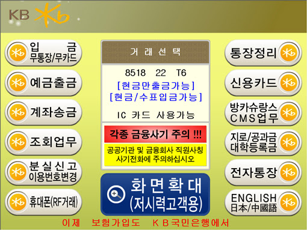

### 1. 기능
- 고객    
  - 사용자는 계정을 생성할 수 있다.
  - 사용자는 이름과 비밀번호를 통해 계정에 접근할 수 있다.

- 계좌
  - 사용자는 계정으로부터 계좌를 개설할 수 있다.
  - 사용자는 계좌를 정지할 수 있다.
  - 사용자는 계좌로부터 거래 기록을 조회할 수 있다.

- 거래
  - 사용자는 원하는 계좌에 일정한 금액을 입금할 수 있다.
  - 사용자는 원하는 계좌에서 일정한 금액을 출금할 수 있다.
  - 사용자는 원하는 계좌에서 다른 계좌로 일정한 금액을 송금할 수 있다.

### 2. TODO
- 도메인 정의
  - [x] 고객
  - [x] 계좌
  - [x] 거래
    - [x] 입출금
    - [x] 송금

- 도메인 로직
  - [x] 고객
    - [x] 생성
    - [x] 로그인

  - [x] 계좌
    - [x] 개설
    - [x] 동결
    - [x] 잔액 조회
    - [x] 거래 기록 조회

  - [x] 거래
    - [x] 입금
    - [x] 출금
    - [x] 송금

- 컨트롤러 계층
  - [ ] BankController
    - [ ] Command
    - [ ] 미인증 상태
    - [ ] 인증 상태

- 예외 처리

- 컨�