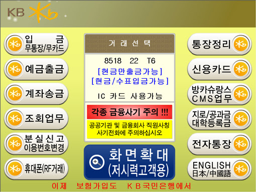

### 1. 기능
- 고객    
  - 사용자는 계정을 생성할 수 있다.

- 계좌
  - 사용자는 계정으로부터 계좌를 개설할 수 있다.
  - 사용자는 계좌를 정지할 수 있다.
  - 사용자는 계좌로부터 거래 기록을 조회할 수 있다.

- 거래
  - 사용자는 원하는 계좌에 일정한 금액을 입금할 수 있다.
  - 사용자는 원하는 계좌에서 일정한 금액을 출금할 수 있다.
  - 사용자는 원하는 계좌에서 다른 계좌로 일정한 금액을 송금할 수 있다.

### 2. TODO
- 도메인 정의
  - [ ] 고객
  - [ ] 계좌
  - [ ] 거래
    - [ ] 입출금
    - [ ] 송금

- 도메인 로직
  - [ ] 고객
    - [ ] 생성

  - [ ] 계좌
    - [ ] 개설
    - [ ] 동결
    - [ ] 거래 기록 조회

  - [ ] 거래
    - [ ] 입금
    - [ ] 출금
    - [ ] 송금

- 예외 처리

- 입출력